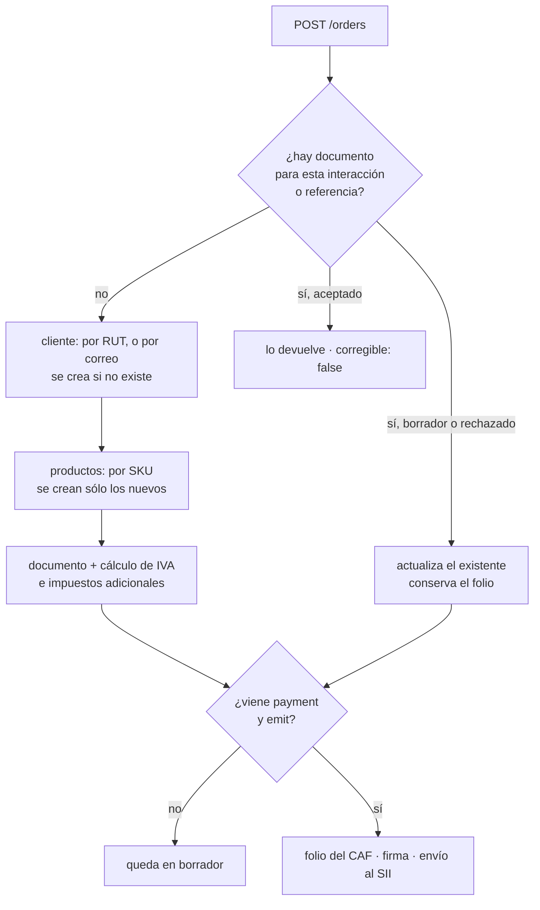

# La API por debajo

El SDK envuelve la API pública de Egestia. Esto sirve para depurar, o para
integrar desde un lenguaje que todavía no tiene SDK.

**Raíz:** `https://api.egestia.cl/api/pub/v1`
**Autenticación:** `x-api-key: egst_…` (también sirve `Authorization: Bearer`)
**Respuestas:** todo viene envuelto en `{ "data": … }`; los errores, en
`{ "error": "…" }`.

## Endpoints

| Método | Ruta | Scope | Para qué |
|---|---|---|---|
| POST | `/orders` | `documents` | Emitir boleta o factura |
| GET | `/documents/:id` | `documents` | Estado del documento |
| GET | `/documents?reference=` | `documents` | Buscar por la referencia de tu venta |
| POST | `/documents/:id/sync` | `documents` | Preguntarle al SII en qué quedó |
| POST | `/documents/:id/void` | `documents` | Anular con nota de crédito |
| GET | `/documents/:id/xml` | `documents` | El DTE firmado |
| GET | `/folios` | `documents` | Folios disponibles por tipo |
| POST | `/honorarios` | `honorarios` | Emitir boleta de honorarios de terceros |
| GET | `/honorarios?reference=` | `honorarios` | Buscar por la referencia de tu pago |
| GET | `/honorarios/:id` | `honorarios` | Estado y montos de la boleta |
| POST | `/honorarios/:id/anular` | `honorarios` | Anularla en el SII |
| POST | `/facturas-compra` | `compras` | Emitir factura de compra (DTE 46) al exterior |
| GET | `/facturas-compra?reference=` | `compras` | Buscar por la referencia de tu pago |
| GET | `/facturas-compra/:id` | `compras` | Estado y montos de la factura |
| POST | `/facturas-compra/:id/verificar` | `compras` | Preguntarle al SII en qué quedó |
| GET | `/products` | `read` | El catálogo |
| POST | `/products/upsert` | `write` | Crear o actualizar por SKU |
| POST | `/stock/commit` | `write` | Descontar stock al cobrar |
| POST | `/stock/release` | `write` | Devolverlo si el pago se cae |

## POST /orders

```jsonc
{
  "type": "boleta",              // boleta | boleta_exenta | factura | factura_exenta
  "reference": "WEB-10045",      // tu número de venta
  "source": "mi-web",
  "storeId": null,               // si tienes varias tiendas
  "interactionId": "int_a1b2…",  // lo pone el SDK

  "contact": {
    "name": "Juan Pérez",
    "rut": "12.345.678-5",       // sin RUT → consumidor final
    "email": "juan@correo.cl",
    "address": "Los Aromos 442", // dirección, ciudad y giro los imprime la FACTURA
    "city": "Santiago",
    "giro": "Particular"
  },

  "items": [
    {
      "sku": "PLAN-BASICO",      // crea el producto la primera vez, lo reutiliza después
      "name": "Plan mensual",
      "unitPrice": 19900,        // NETO: Egestia calcula el IVA
      "quantity": 1,
      "discount": 0,
      "isService": true          // un servicio no descuenta stock
    }
  ],

  "payment": { "method": "webpay", "amount": 23681 },  // si viene, se emite al SII
  "emit": true
}
```

Respuesta:

```jsonc
{
  "data": {
    "id": "d41f…", "folio": "5001", "type": "boleta",
    "total": 23681, "status": "sent_to_sii", "trackId": "12334111550",
    "interactionId": "int_a1b2…", "attempts": 1,
    "reintento": false,
    "corregible": true         // false cuando el SII ya lo aceptó
  }
}
```

**El 502 que no es un fallo cualquiera** — el documento existe:

```jsonc
{
  "error": "Documento creado pero no emitido: No hay folios disponibles…",
  "data": {
    "id": "d41f…", "status": "draft",
    "motivo": "No hay folios disponibles para este tipo de documento",
    "sii": null,
    "interactionId": "int_a1b2…", "folioReservado": null
  }
}
```

## Qué hace Egestia con el pedido



Sobre el cliente: si ya existe, se **completa** lo que le falte —típicamente la
dirección, que llega recién al comprar— sin pisar lo que el ERP ya tenía. El ERP
es la fuente de verdad; la web sólo aporta lo que él todavía no sabe.

## POST /documents/:id/void

```jsonc
{ "motivo": "Compra devuelta por el cliente", "emitir": true }
```

Emite la nota de crédito con `CodRef 1` —«anula el documento de referencia»—
copiando líneas y cliente del original. Idempotente: si ya estaba anulado
devuelve la nota existente con `repetido: true`.

## POST /honorarios

Boleta de honorarios de terceros (BHTE). Otro registro del SII: no es un DTE y
no gasta folios del CAF.

```jsonc
{
  "rut": "11.111.111-1",         // el PRESTADOR: quien hizo el trabajo
  "name": "Ana Soto",
  "grossAmount": 1000000,        // el BRUTO. La retención la aplica el SII
  "reference": "PAGO-77",        // tu número de pago
  "source": "pagos",
  "issueDate": "2026-09-17",     // por defecto, hoy
  "description": "Diseño de marca",
  "branchId": 3,                 // número de sucursal, o su UUID

  // Sólo para un prestador que todavía no es contacto en Egestia: normalmente
  // se toman de su ficha. El SII los imprime en la boleta y sin ellos rechaza.
  "direccion": "Los Aromos 442",
  "comuna": "Providencia"
}
```

Respuesta:

```jsonc
{
  "data": {
    "id": "8f2c…", "folio": "184", "status": "vigente", "kind": "emitida",
    "issuer": { "rut": "11111111-1", "name": "Ana Soto", "contactId": "c1…" },
    "issueDate": "2026-09-17", "period": "202609",
    "grossAmount":    1000000,   // lo que ganó el prestador
    "withholdingRate":   14.5,   // la tasa del SII, en PORCENTAJE
    "withheldAmount":  145000,   // lo entera la empresa al SII
    "netAmount":       855000,   // ← lo único que se transfiere
    "siiCode": "ABC123", "branchId": "a4f0…",
    "reference": "PAGO-77", "source": "pagos",
    "repetido": false
  }
}
```

`201` cuando se emitió; `200` con `repetido: true` cuando esa referencia ya
tenía boleta y no se emitió nada.

**El 409 que hay que mirar** — misma referencia, otro monto:

```jsonc
{
  "error": "La referencia «PAGO-77» ya emitió una boleta por $1000000, y ahora se pide por $500000…",
  "data": { "id": "8f2c…", "folio": "184", "netAmount": 855000, "repetido": true }
}
```

No es un reintento: es otro pago con la referencia equivocada. Devolver la
boleta vieja en silencio haría transferir el líquido de otra prestación.

El otro 409 es `Ya se está emitiendo la boleta de la referencia «…»`: hay una
llamada con esa misma referencia emitiendo en este instante. **No emitas otra**
—espera y consulta por referencia—. Es un candado de base de datos, y existe
porque el `GET` previo no alcanza a ver lo que todavía se está emitiendo: sin
él, dos llamadas simultáneas emiten dos boletas ante el SII.

## POST /honorarios/:id/anular

```jsonc
{ "causa": "error_digitacion" }   // o "no_prestacion". El SII no acepta otras.
```

A diferencia de un DTE, una boleta de honorarios se anula de verdad: no hay
nota de crédito de por medio. La anulación queda declarada y el prestador puede
reclamarla, por eso la causa es obligatoria.

Idempotente: si ya estaba anulada devuelve esa misma con `repetido: true`.
Anular **no** devuelve la plata ya transferida.

## POST /facturas-compra

Factura de compra electrónica (DTE 46) por un servicio prestado desde el
exterior. Usa el mismo esquema de XML que el 33, pero es una COMPRA: deja cuenta
por pagar y crédito fiscal, no cuenta por cobrar.

```jsonc
{
  "name": "Jane Doe",            // el PRESTADOR: quien hizo el trabajo
  "rut": null,                   // su número en la nómina del SII; si no, se resuelve
  "country": "US",
  "amount": 1000,                // el NETO, en la moneda del pago
  "currency": "USD",             // USD | EUR | CLP
  "description": "Contenido de septiembre",
  "reference": "PAY-501",        // tu número de pago
  "source": "mi-plataforma",
  "issueDate": "2026-09-18",     // por defecto, hoy en Chile
  "exchangeRate": null,          // lo resuelve Egestia con el valor del día
  "expenseAccountId": null,      // sin ella, la cuenta de gastos por omisión
  "emit": true                   // false deja un borrador, sin tocar el SII

  // Alternativa a `amount`, si el pago tiene detalle:
  // "items": [{ "description": "…", "quantity": 1, "unitPrice": 500, "amount": 500 }]
}
```

Respuesta:

```jsonc
{
  "data": {
    "id": "8f2c…", "folio": "87", "status": "enviada", "dteCode": 46,
    "supplier": { "rut": "55555555-5", "name": "Jane Doe", "country": "US", "contactId": "c9…" },
    "issueDate": "2026-09-18", "period": "202609",

    "currency": "USD", "amount": 1000, "exchangeRate": 980.5,

    "net":      980500,   // el neto en pesos
    "tax":      186295,   // el IVA recargado: crédito fiscal
    "withheld": 186295,   // el IVA retenido: código 39 del F29
    "total":    980500,   // el total del documento, que ES el neto

    "trackId": "9911",
    "reference": "PAY-501", "source": "mi-plataforma",
    "avisos": ["Jane Doe no figura entre los inscritos conocidos: se usa 55555555-5."],
    "repetido": false
  }
}
```

`201` cuando se emitió; `200` con `repetido: true` cuando esa referencia ya tenía
factura y no se emitió nada.

**Los montos, en una línea:** se manda el NETO y el total del documento vuelve a
ser el neto, porque el IVA se recarga y se retiene entero (`neto + IVA − IVA
retenido = neto`). Al prestador se le transfiere `amount` en su moneda —o `net`
en pesos—; nunca `net + tax`.

**El RUT:** el receptor es el número del prestador en la nómina de prestadores
extranjeros inscritos del SII, o `55555555-5` si no está inscrito. Lo que se
manda en `rut` se usa sólo si tiene forma de RUT chileno; en cualquier otro caso
Egestia resuelve el que corresponde y lo dice en `avisos`.

**El 502 que no es un fallo cualquiera** — la factura existe, en borrador:

```jsonc
{
  "error": "Factura creada pero no emitida: No hay CAF de factura de compra (tipo 46) para el folio 87.",
  "data": { "id": "8f2c…", "status": "borrador", "folio": null, "motivo": "…", "sii": null }
}
```

Ahí el reintento con la MISMA referencia retoma ese borrador y lo emite —con su
folio si alcanzó a tener uno— en vez de crear otro. Los dos casos que llevan
ahí son el CAF del tipo 46 sin cargar y el tipo de cambio que no se pudo
obtener; ninguno de los dos se resuelve emitiendo de nuevo desde cero.

El otro 409 es `Ya se está emitiendo la factura de compra de la referencia «…»`:
hay una llamada con esa referencia emitiendo en este instante.

## POST /facturas-compra/:id/verificar

Le pregunta al SII (QueryEstDte) y actualiza el estado: `enviada` →  `aceptada`
o `rechazada`. No lleva cuerpo.

**No hay endpoint para anular.** Un DTE 46 emitido se echa atrás con una nota de
crédito, y eso hoy se hace desde Egestia.

## GET /folios

```jsonc
{
  "data": {
    "mode": "produccion",
    "tipos": [
      { "dteCode": 39, "disponibles": 120, "desde": 8001, "hasta": 8120, "cafs": 1 }
    ]
  }
}
```

## La sucursal, cuando hay más de una tienda online

Las llamadas que miran o mueven stock aceptan `branchId`. Si no viene, Egestia
usa **la sucursal marcada como tienda online**.

Mientras haya una sola, no hay que mandar nada. Con dos o más, la llamada
responde **422** pidiendo la sucursal, porque adivinar de qué bodega descontar es
peor que preguntar: se vendería de un stock que no es.

```json
{ "error": "Hay más de una sucursal de tienda online: indica branchId." }
```

El mismo `branchId` es el que factura, así que los reportes por sucursal
muestran cada venta donde corresponde.

## Errores

| Código | Significa |
|---|---|
| 400 | Los datos no pasan la validación |
| 401 | API key inválida o expirada |
| 403 | Falta el scope |
| 404 | No existe para esa key |
| 409 | Conflicto de estado: ya emitido, sin folios, sin configurar |
| 502 | **Documento creado pero no emitido** — mira `data.id` |
