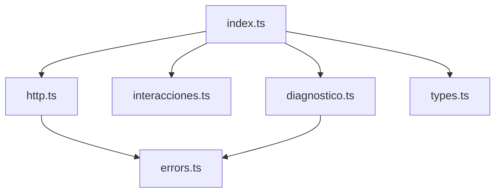
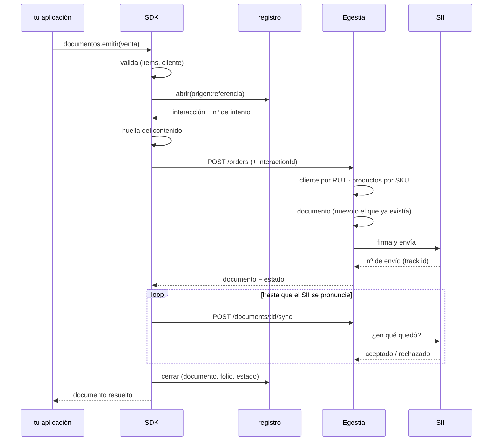

# Arquitectura

Cinco archivos, cada uno con un trabajo. Ninguno depende de nada externo: el
paquete no tiene dependencias y usa el `fetch` que trae Node 18.

```
src/
  index.ts          la cara pública: Egestia, documentos, productos, stock
  http.ts           una petición: cabeceras, tiempo de espera, reintentos
  errors.ts         los errores, tipados
  diagnostico.ts    traduce un error a «qué pasó y qué hacer»
  interacciones.ts  el registro de envíos, que es lo que evita duplicar DTE
  types.ts          los tipos del contrato
```

La dirección de las dependencias es siempre la misma —hacia abajo— y no hay
ciclos:



## Qué pasa en una emisión



Los pasos que **no** son evidentes:

- **La validación es antes de salir a la red.** Una venta sin líneas o sin
  nombre de cliente se rechaza en el SDK: no tiene sentido gastar un viaje —ni
  una línea en el log de Egestia— en algo que ya se sabe que está mal.
- **La huella se calcula siempre**, aunque sea el primer envío. Es lo que en el
  segundo permite decir «esto cambió».
- **El bucle del final es la diferencia** entre este SDK y llamar al endpoint a
  mano. El SII acepta el envío y resuelve después; sin ese bucle te quedas con
  un documento en `sent_to_sii` y sin saber cómo terminó.

## `http.ts`: una petición

Hace cuatro cosas, y las cuatro importan:

**Cabeceras.** `x-api-key` con tu clave, y un `User-Agent` que incluye tu
`appName` — así, cuando algo falla, en el log de Egestia se ve qué sistema
llamó.

**Tiempo de espera.** 30 segundos por defecto, con `AbortController`. Sin esto
una petición colgada bloquea tu proceso indefinidamente.

**Reintentos.** Sólo si la operación es repetible, y con espera creciente:

| intento | espera antes |
|---|---|
| 1 | — |
| 2 | 400 ms |
| 3 | 800 ms |

Qué se reintenta y qué no:

| respuesta | ¿se reintenta? | por qué |
|---|---|---|
| sin red / tiempo agotado | sí | no llegó, o no se sabe |
| 5xx, 429 | sí | el otro lado se cayó, no tus datos |
| 400, 422 | no | repetir lo mismo da lo mismo |
| 401, 403 | no | la clave no va a mejorar sola |
| **502 de emisión** | **no** | el documento YA existe: hay que mirarlo |

Ese último es el que más se equivoca al integrar a mano. Está explicado en
[reintentos y folios](reintentos-y-folios.md).

**Desempaquetado.** La API responde `{ "data": ... }`. El SDK devuelve el
contenido, no el sobre. Detalle que costó un error: se comprueba si la clave
`data` **existe**, no si tiene valor. Con `?? sobre`, un `{ "data": null }`
—«esa venta todavía no tiene documento»— se devolvía como el objeto entero en
vez del `null` que significa.

## `interacciones.ts`: el registro

Guarda, por venta, qué envío la generó y cómo terminó:

```ts
{
  id: 'int_a1b2c3…',        // lo que viaja a Egestia
  clave: 'mi-web:P-1024',   // origen + referencia
  intentos: 2,
  documentId: 'd41…',
  folio: '5001',
  estado: 'rejected',
  ultimoProblema: 'No hay folios disponibles',
  huella: 'k3f9x1',         // para distinguir corrección de reenvío
}
```

Por defecto vive en memoria (`AlmacenEnMemoria`). La interfaz es a propósito de
dos métodos —`leer` y `guardar`— para que enchufar Redis o una tabla sea corto:

```ts
new Egestia({
  apiKey,
  almacen: {
    async leer(clave)           { return JSON.parse(await redis.get(clave) ?? 'null'); },
    async guardar(clave, inter) { await redis.set(clave, JSON.stringify(inter)); },
  },
});
```

**Cuándo importa persistirlo:** si el proceso que reintenta puede ser otro que
el que emitió —una cola distribuida, un contenedor que se reinicia— la memoria
no alcanza. Sin registro, el SDK no reconoce el reenvío; el respaldo es la
`referencia`, que Egestia también sabe buscar, así que no se duplica igual —
pero el número de intentos y la huella se pierden.

## `diagnostico.ts`: del error al «qué hago»

Toma cualquier error y devuelve un `Problema`: tipo, mensaje, qué hacer, si
conviene reintentar, y si el documento quedó creado. El catálogo completo está
en [problemas](problemas.md).

Lo importante del diseño: **el tipo no sale del código HTTP**, sale del mensaje.
Un 409 puede ser «ya está emitido» o «no hay folios», y son situaciones
distintas con salidas distintas.
