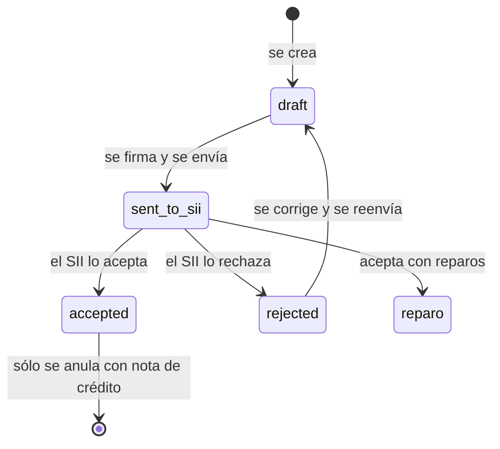
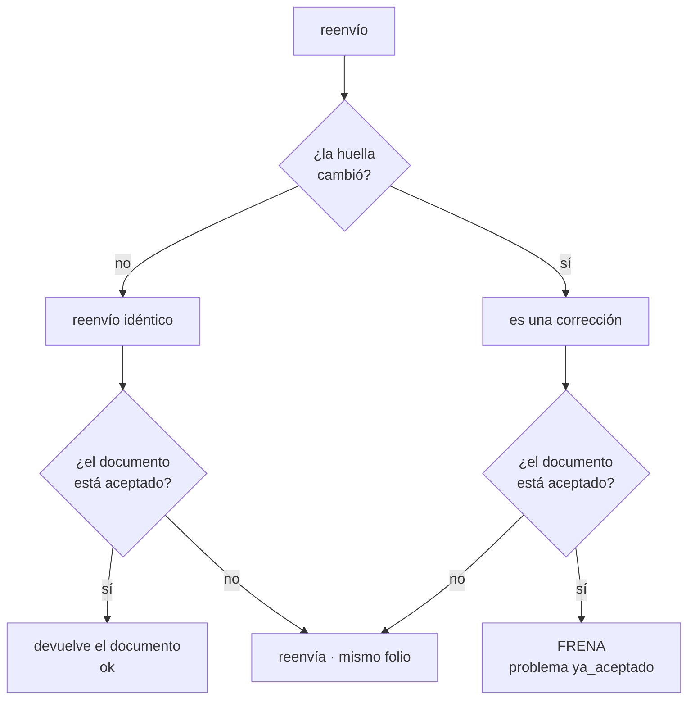

# Estados del documento

Un DTE pasa por estos estados, y de cuál esté depende lo que se puede hacer con
él.



| Estado | Qué pasó | ¿Se puede corregir? |
|---|---|---|
| `draft` | Creado en Egestia, sin ir al SII | **Sí**, reenviando la venta |
| `rejected` | El SII lo rechazó | **Sí**, reenviando — conserva el folio |
| `sent_to_sii` | Enviado, esperando respuesta | No: espera el veredicto |
| `accepted` | El SII lo aceptó | **No.** Anular y emitir uno nuevo |
| `reparo` | Aceptado con observaciones | No: se corrige con nota de crédito o débito |

## Por qué lo aceptado no se corrige

Cuando el SII acepta un DTE, ese documento **existe**: tiene folio asignado,
está en el libro de ventas del emisor y en el registro de compras del receptor.
Cambiarle un dato sería reescribir algo que ya se declaró.

La ley da otra salida: emitir una **nota de crédito** que lo anule, y después el
documento correcto. Eso deja rastro de las tres cosas —lo que se emitió, la
anulación y lo definitivo— que es justo lo que la autoridad quiere ver.

## Cómo lo detecta el SDK

Acá está la parte que no es evidente. Hay que distinguir dos reenvíos que se ven
igual desde afuera:

| | Qué es | Qué corresponde |
|---|---|---|
| Reenvío **idéntico** | La cola reintentando, un doble clic | Devolver el documento. No es un error |
| Reenvío **con cambios** | Alguien corrigió un dato | Si ya está aceptado: **frenar** |

El SDK guarda una **huella** del contenido de cada envío —tipo, cliente y
líneas— en el registro de interacciones. Al reenviar compara:



La huella no pretende ser criptográfica: sólo tiene que cambiar cuando cambian
los datos que llegan al documento.

Cuando frena, el problema lo dice con todas sus letras:

```
tipo ........ ya_aceptado
mensaje ..... El SII ya aceptó este documento: no admite correcciones.
qué hacer ... Anúlalo con una nota de crédito y emite uno nuevo:
              documentos.anularYReemitir(id, ventaCorregida)
```

## Anular y reemitir

```ts
const { anulado, emitido } = await egestia.documentos.anularYReemitir(doc.id, ventaCorregida);
```

En un paso: emite la nota de crédito que anula el original —copiando sus líneas
y su cliente— y después el documento nuevo con los datos correctos.

La nota de crédito lleva la referencia que la convierte en **anulación** y no en
una devolución cualquiera:

```
tipo ......... nota_credito (DTE 61)
referencia ... tipo 39 · folio 1001 · fecha del original
CodRef ....... 1          ← «anula el documento de referencia»
```

`anular()` es idempotente: si el documento ya tiene su nota de crédito, devuelve
esa misma con `repetido: true` en vez de emitir una segunda —que sería otro
folio gastado y un descuadre.

Al reemitir, la venta nueva lleva una `referencia` distinta a propósito: usar la
misma reabriría la interacción del documento recién anulado.

## Lo que no se puede anular

Un borrador. Todavía no existe para el SII, así que no hay nada que anular; se
descarta desde Egestia. El SDK lo dice:

```
tipo ........ validacion
mensaje ..... El documento no tiene folio: todavía no se emitió, no hay nada que anular
```
