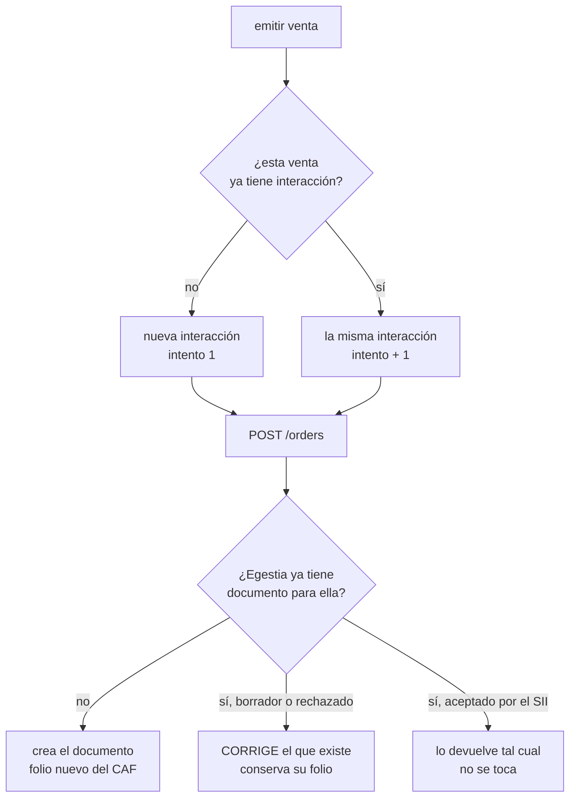

# Reintentos y folios

> **La regla:** un reintento usa el mismo folio. Siempre.

Todo lo demás de este documento existe para cumplirla.

## Por qué importa tanto

Un folio es un número autorizado por el SII. Vienen en paquetes —el CAF— y son
finitos: cuando se acaban hay que pedir más y cargarlos. Emitir un documento
consume uno, y **no se devuelve**.

Si una venta se emite dos veces:

- se gastan dos folios donde correspondía uno,
- el cliente recibe dos boletas por la misma compra,
- el libro de ventas queda descuadrado,
- y arreglarlo exige una nota de crédito, que gasta **otro** folio.

Un reintento mal hecho no es un error técnico: es plata y es un problema
contable.

## Cómo lo evita el SDK

Cada envío abre una **interacción**: un identificador que el SDK genera, guarda
y manda. No se lo pide a quien integra —bastaría que se le olvidara una vez—.



La rama del medio es la que cumple la regla. En Egestia, actualizar un documento
rechazado lo devuelve a borrador y limpia el XML, **pero deja el folio intacto**
justo para que el siguiente intento lo reutilice.

## Un caso real

```
1. primer envío, con el precio en cero
   → documento 8112790f · folio 5001 · rechazado

2. alguien corrige el precio y reenvía la misma venta
   → documento 8112790f  ← el mismo
     folio      5001     ← el mismo
     total      $142.800 ← el dato corregido
     intento    2

3. la cola reintenta una vez más
   → mismo documento · intento 3 · ningún folio nuevo
```

Nadie le pasó nada especial al SDK. Sólo volvió a llamar a `emitir()` con la
misma `referencia`.

## Las dos llaves

Egestia busca el documento previo por dos caminos, en este orden:

1. **La interacción** (`interactionId`), que pone el SDK. Sobrevive a que los
   datos cambien: es lo que identifica *el envío*.
2. **La referencia** (`reference` + `source` + `storeId`), que es el número de
   la venta en tu sistema.

La interacción manda porque es más precisa, y la referencia es la red de
seguridad: si el registro se perdió —el proceso se reinició, no persististe el
almacén— la referencia igual encuentra el documento y no se duplica nada.

Por eso `referencia` es lo único que el SDK sí necesita de ti. En la práctica
siempre lo tienes: es el id del pedido.

En la base hay un índice único por `(tenantId, externalInteractionId)`. Dos
envíos simultáneos de la misma venta no pueden terminar en dos documentos: uno
de los dos choca contra el índice.

## Reintentar sin saber si llegó

El caso feo: mandaste, se cortó la red, y no sabes si alcanzó a emitirse.

**No reintentes a ciegas.** Pregunta:

```ts
const existente = await egestia.documentos.buscarPorReferencia(pedido.id, { origen: 'mi-web' });

if (existente) {
  // ya se facturó: usa su folio
} else {
  await egestia.documentos.emitir(venta);
}
```

Es exactamente lo que dice el `queHacer` del problema de tipo `red`.

## Por qué el 502 de emisión no se reintenta solo

Cuando Egestia responde «documento creado pero no emitido», el documento
**existe**. El SDK no lo reintenta automáticamente y marca
`reintentable: false`, aunque técnicamente sea un 5xx.

La razón: la causa suele ser de configuración —sin folios, sin certificado, el
ambiente del SII apagado— y repetir en 400 ms no la arregla. Lo que corresponde
es mirar el `documentId` que viene en el problema, resolver la causa, y reenviar
la venta cuando esté resuelta. Al reenviarla, por todo lo anterior, se emite
**ese mismo documento con su folio**.

## Cuándo sí nace un folio nuevo

Sólo en tres situaciones:

1. Una venta que nunca se envió antes.
2. Una venta con una `referencia` distinta a propósito (una venta nueva de
   verdad).
3. Una **nota de crédito**: anular consume su propio folio, del CAF de tipo 61.
   Es inevitable y es correcto: la anulación es un documento tributario más.
